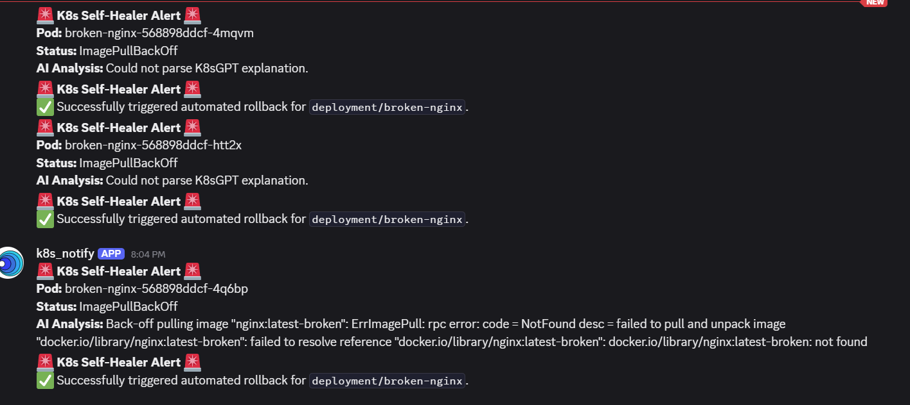

# Self-Healing Kubernetes Tools



Small helper scripts for a demo SRE agent and notifier that interact with a remote agent and a Kubernetes cluster.

**Files**

- `antigravity.py`: Starts the Antigravity SRE Agent stream (uses `google.genai`). Expects the API key in the environment (`GENAI_API_KEY` or `GOOGLE_API_KEY`).
- `notifyer.py`: Notification helper used by the project (run as needed).
- `deployment.yml`: Example Kubernetes deployment (contains `broken-nginx`).
- `webhook.txt`: Text payload or webhook example used by `notifyer.py`.

**Prerequisites**

- Python 3.8+
- `kubectl` configured to access your cluster (if you want the scripts to operate against Kubernetes).
- A GenAI API key (set as `GENAI_API_KEY` or `GOOGLE_API_KEY`).

**Recommended Python dependencies**

Create a virtual environment and install the GenAI client (example package name shown — adjust if different):

```bash
python -m venv .venv
source .venv/bin/activate   # on Windows PowerShell: .\.venv\Scripts\Activate
pip install google-genai
```

**Usage**

1. Export your API key into the environment:

PowerShell (Windows):

```powershell
$env:GENAI_API_KEY = "your_key_here"
```

macOS / Linux:

```bash
export GENAI_API_KEY="your_key_here"
```

2. Run the Antigravity agent streamer:

```bash
python antigravity.py
```

3. Use `kubectl` to inspect or fix the `broken-nginx` deployment:

```bash
kubectl get pods -n default
kubectl describe deployment broken-nginx -n default
kubectl logs deploy/broken-nginx -n default
```

**Notes**

- `antigravity.py` has robust stream handling and expects the GenAI client to provide an iterable/stream of chunks. If you see errors mentioning a non-callable stream, ensure the client object ret[...]
- If you want, I can add a `requirements.txt` file or pin exact package names/versions.

**Next steps**

- Add `requirements.txt` (optional).
- Add example env file or a small wrapper script for Windows.

---

Created for the `self_healing_k8s` workspace.

